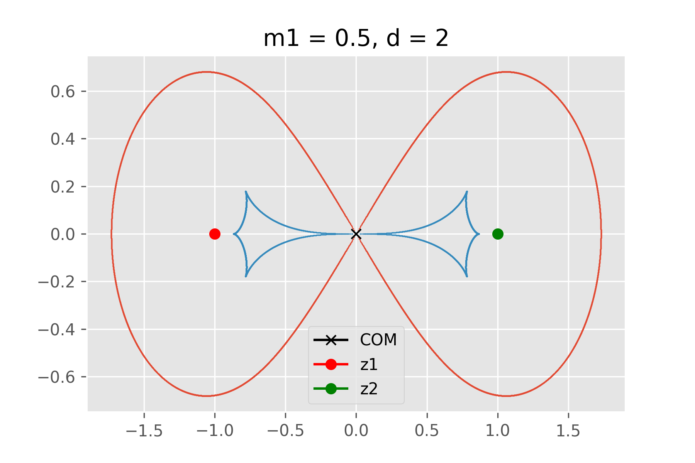
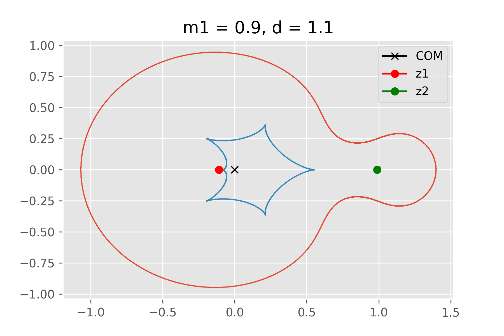
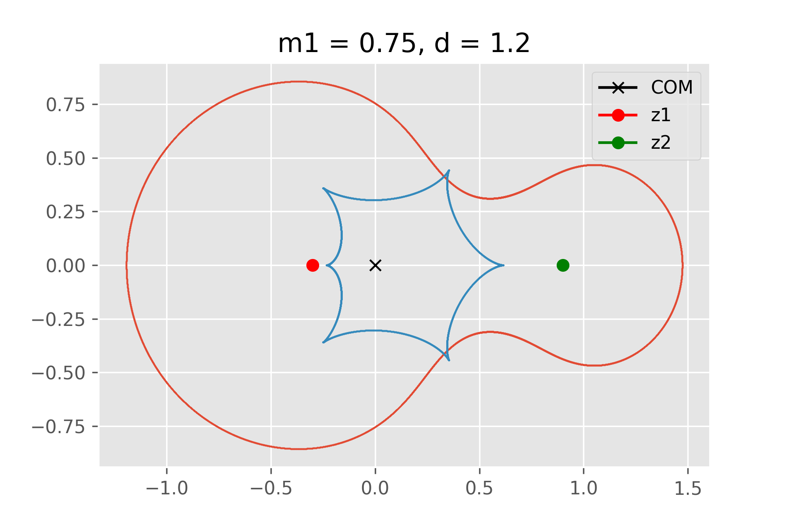
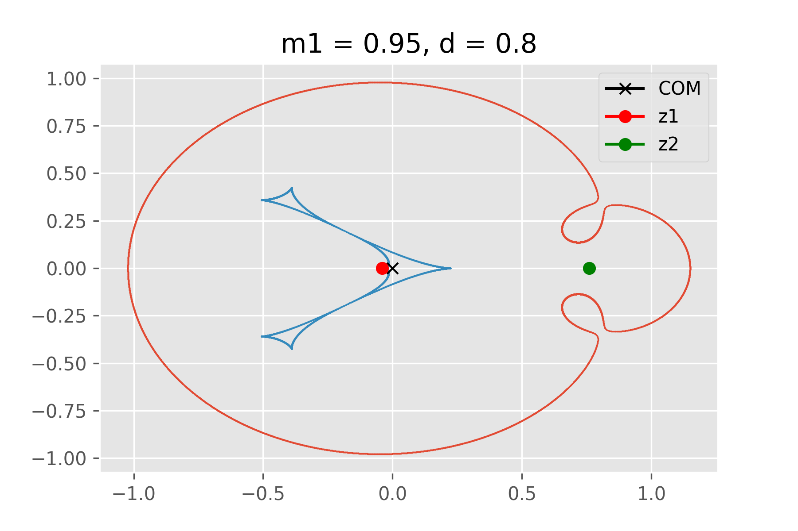

# binary-lens-curves
This is a short script that plots the critical and caustic curves of a binary lens system using a 4th degree complex polynomial derived from the binary lens equation in complex coordinates. Some examples plots are below:

